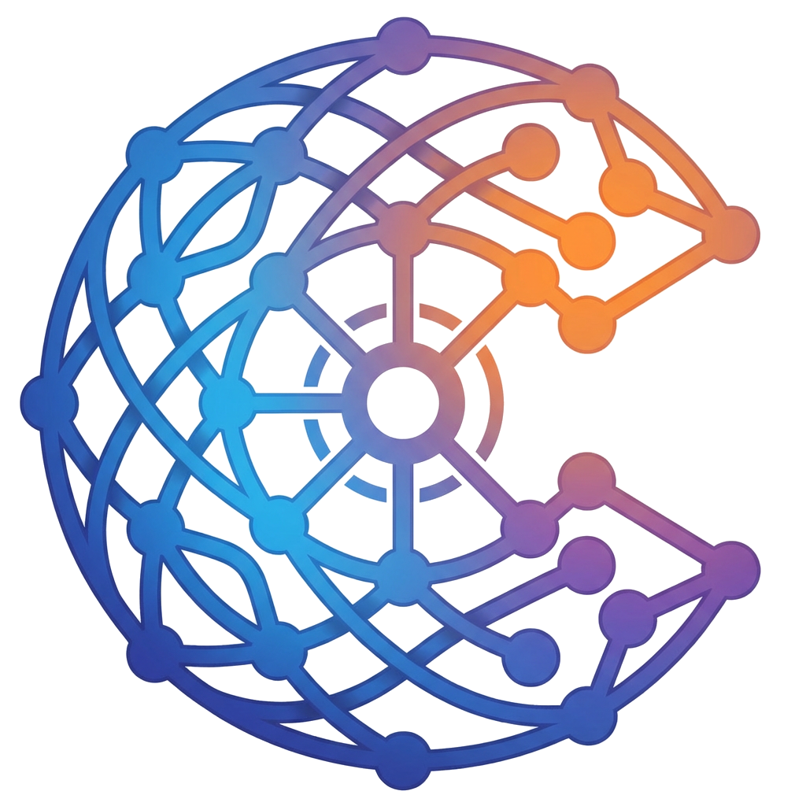
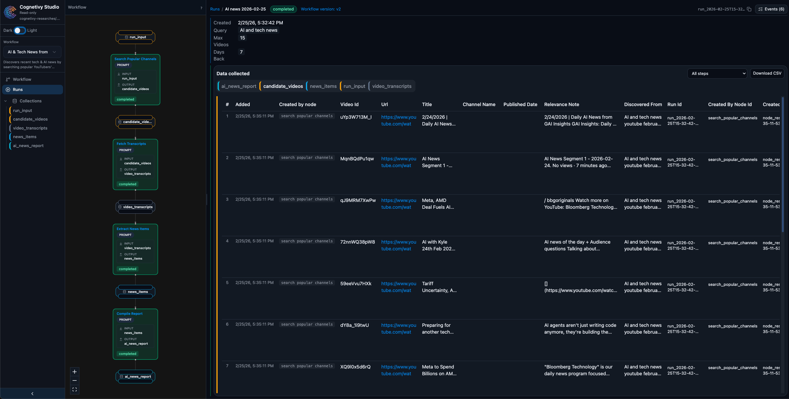
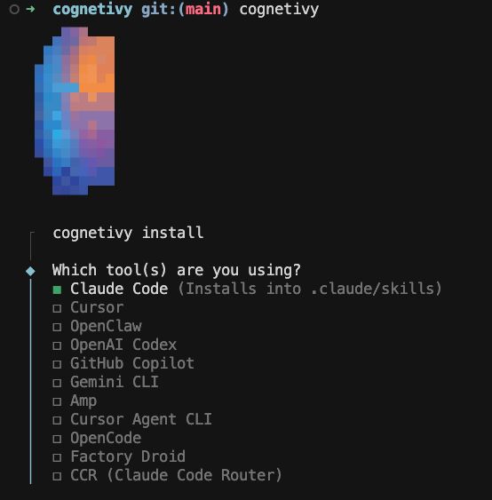
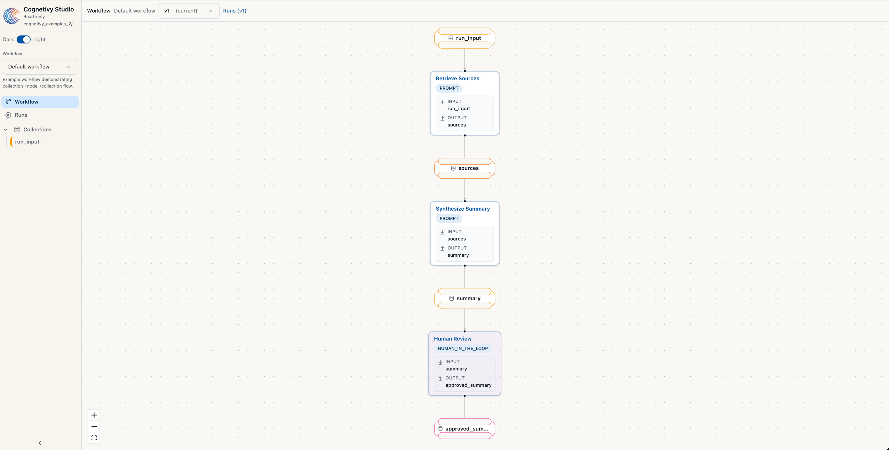
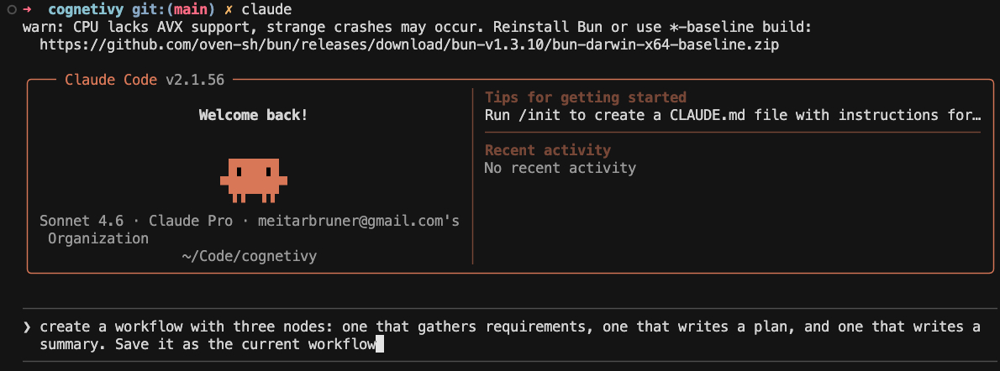

<p align="center">
  
</p>

# Cognetivy

[](https://www.npmjs.com/package/cognetivy) [](https://opensource.org/licenses/MIT)



Cognetivy is an open-source state layer for AI-assistants like Claude Code, Cursor, OpenClaw, etc. It helps you define workflows, track runs and events, and store structured collections in a local `.cognetivy/` workspace. No LLMs inside - just the data and tools your editor's agent uses via [Skills](https://agentskills.io/) and [MCP](https://agentskills.io/). Works with **Claude Code**, **Cursor**, **OpenClaw**, and other Skills and MCP-compatible clients.

## Why Cognetivy

AI coding agents are great at producing output, but their process is usually hard to inspect and hard to repeat.

Cognetivy gives your agent an operational layer so you can:

- **Define how it should work** with explicit workflows
- **Track what happened** in each run and event
- **Keep reasoning artifacts organized** in structured collections
- **Re-run and compare outcomes** with a persistent local workspace

In short: Cognetivy turns powerful-but-chaotic agent sessions into structured, auditable workflows.

## Explain it like I'm new to this

Think of your coding agent as a very smart intern:

- The model is the **brain**
- Your editor is the **workspace**
- Cognetivy is the **memory + process manager**

Without Cognetivy, a lot of important context lives in chat history and disappears.
With Cognetivy, that work is captured as workflows, runs, events, and collections inside `.cognetivy/`.


**Project status:** Actively maintained. We welcome [issues](https://github.com/meitarbe/cognetivy/issues) and [pull requests](https://github.com/meitarbe/cognetivy/pulls).

**Great for:**

- Building repeatable AI coding workflows
- Running structured research tasks with coding agents
- Teams that need traceability and auditability for agent output

## Requirements

- **Node.js** ≥ 18
- A project directory (or an empty folder) to create a workspace in
- A coding agent (Claude Code, Cursor, OpenClaw, etc.) working on that directory

---

## Install

Run once with npx (no global install):

```bash
npx cognetivy
```

Or install globally for use from any directory and for MCP:

```bash
npm install -g cognetivy
```

---

## Step-by-step

### Step 1 - Run cognetivy

Open a terminal in your project folder (or an empty folder) and run:

```bash
npx cognetivy
```
An installer will open in the terminal:

---

### Step 2 - Use the installer



1. In the installer, choose your coding agent (Claude Code, Cursor, OpenClaw, etc.)
2. Cognetivy will create a `.cognetivy/` workspace in the current folder.
3. Cognetivy will install its skills into the workspace.

---

### Step 3 - Studio opens



When the installer finishes, Cognetivy Studio opens in your browser.

You'll see the read-only UI: workflow, runs, and collections.

---

### Step 4 - Ask your agent to create a workflow and run it



In another chat window, ask your agent to create a workflow and run it.

- "Create a workflow with three nodes: one that gathers requirements, one that writes a plan, and one that writes a summary. Save it as the current workflow."
- "Start a run for the current workflow with input with the topic 'user onboarding'."

## Connect your agent (MCP)

Cognetivy works best with **agent skills**, but you can connect via **MCP** so cognetivy tools appear in chat.

### Cursor

1. Open **Settings** → **Tools & MCP** (or **Features** → **MCP**).
2. Click **Add new MCP server**.
3. Set **Name** to `cognetivy`.
4. Set **Command** to `cognetivy` (or the full path if not on PATH).
5. Set **Arguments** to `mcp`. If your project root is not the folder that contains `.cognetivy/`, add `--workspace` and the path to that folder (e.g. `--workspace ./example-usage`).
6. Save and restart Cursor.

Cognetivy tools (workflow, run, event, collection, node, etc.) will then be available in chat.

**Optional — config file:** You can instead add the server to `~/.cursor/mcp.json` (or your project’s `.cursor/mcp.json`):

```json
{
  "mcpServers": {
    "cognetivy": {
      "command": "cognetivy",
      "args": ["mcp"]
    }
  }
}
```

Use `"args": ["mcp", "--workspace", "/path/to/folder/with/.cognetivy"]` if the workspace is not your current project root.

## Commands

| Command | Description |
|--------|-------------|
| `npx cognetivy` | Run installer and open Studio (first time) or open Studio |
| `cognetivy workflow get` | Print current workflow |
| `cognetivy run start --input <file>` | Start a run |
| `cognetivy studio` | Open Studio in the browser |
| `cognetivy mcp` | Start MCP server (for your editor) |
| `cognetivy install cursor` | Install skills into Cursor (`claude`, `openclaw`, `workspace` also supported) |

---

## Community

- [Contributing](CONTRIBUTING.md) — how to run the project, run tests, and submit changes
- [Code of Conduct](CODE_OF_CONDUCT.md)
- [Report a bug](https://github.com/meitarbe/cognetivy/issues/new?template=bug_report.md) · [Request a feature](https://github.com/meitarbe/cognetivy/issues/new?template=feature_request.md)

---

## License

[MIT](LICENSE)
