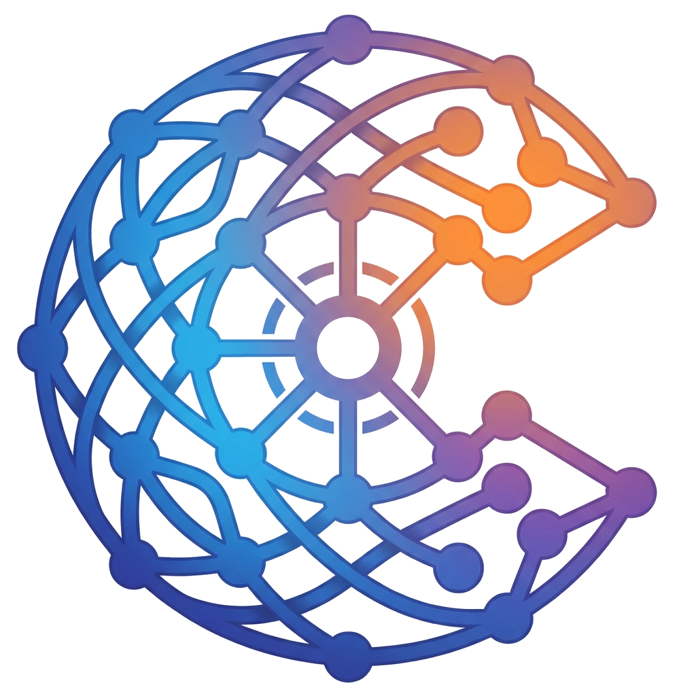
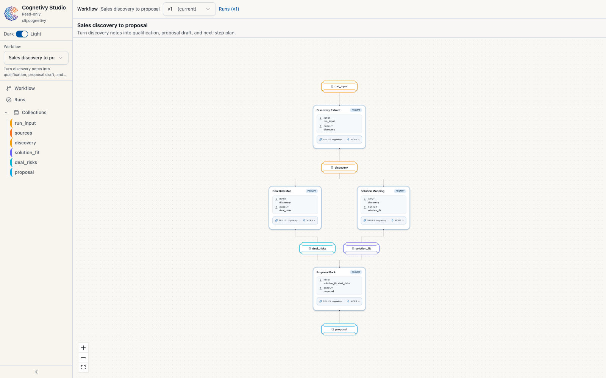
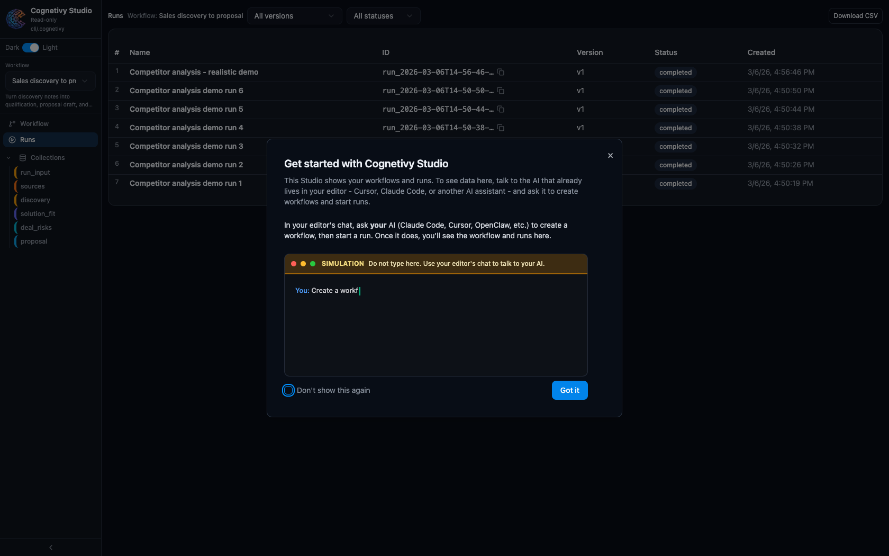
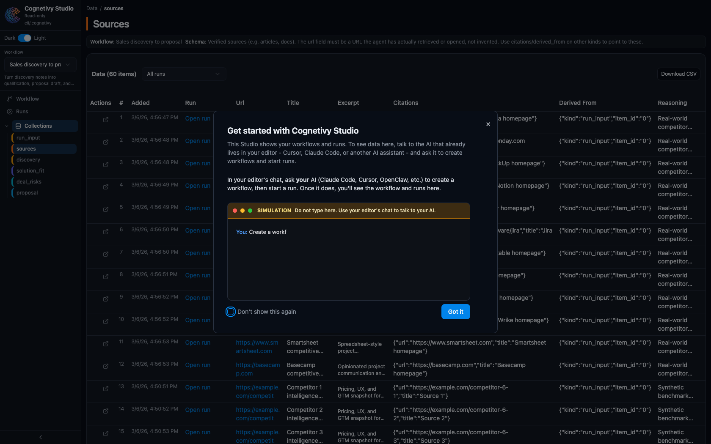

<p align="center">
  
</p>

# Cognetivy

[](https://www.npmjs.com/package/cognetivy)
[](https://opensource.org/licenses/MIT)

**Website:** [cognetivy.com](https://cognetivy.com)

🎬 **Quick product video (top):** [Watch walkthrough](docs/media/readme/studio-walkthrough.webm)

<video src="docs/media/readme/studio-walkthrough.webm" controls muted playsinline width="100%"></video>

Cognetivy is an open-source orchestration + memory layer for AI agents.
It gives your agent a structured local workspace (`.cognetivy/`) to manage:

- **Workflows** (how work should happen)
- **Runs** (what happened each execution)
- **Events** (timeline + state transitions)
- **Collections** (structured outputs with schema)

It works with Claude Code, Cursor, OpenClaw, and other MCP/Skills-compatible clients.

---

## Why teams use Cognetivy

Without Cognetivy, important agent context gets lost in chat logs.
With Cognetivy, work becomes **traceable, repeatable, and inspectable**.

- ✅ Re-run the same process with new input
- ✅ Audit decisions and generated artifacts
- ✅ Keep outputs structured and queryable
- ✅ Make agent workflows easier to debug and improve

---

## Product tour (captured with Playwright)

### Workflow view


### Runs list


### Run detail


### Collections/data


🎬 **Walkthrough video:** [Open studio walkthrough (webm)](docs/media/readme/studio-walkthrough.webm)

---

## Install

### Option A — one-shot (recommended)

```bash
npx cognetivy
```

This starts the interactive installer and opens Studio.

### Option B — global

```bash
npm install -g cognetivy
```

---

## 2-minute quick start

1. Open your project folder
2. Run:

```bash
npx cognetivy
```

3. In the installer:
   - choose your tool(s): OpenClaw / Claude Code / Cursor / etc.
   - choose a workflow template (interactive)
4. Studio opens automatically

That’s it — you now have a working `.cognetivy/` workspace.

---

## Templates

Cognetivy ships practical templates (product, ops, sales, marketing, research, people-ops, and more).

```bash
# interactive template picker + apply
cognetivy workflow templates

# list templates as JSON
cognetivy workflow templates --list

# apply specific template directly
cognetivy workflow apply-template --id bug-triage-and-fix
```

Applying a template creates a workflow, sets it current, and creates needed collection schema kinds.

See full gallery: [docs/TEMPLATES.md](docs/TEMPLATES.md)

### Example use case: Competitor analysis (sample/fake data)

Below is **fake demo data** to show how a competitor-analysis run can look in collections.

| competitor | pricing_model | est_starting_price | strengths | weaknesses | confidence |
|---|---|---:|---|---|---:|
| FluxBoard | Seat-based | $29/user | Strong onboarding, polished UX | Limited API depth | 0.78 |
| SprintPilot | Usage-based | $0.004/event | Flexible automations, fast exports | Steeper learning curve | 0.71 |
| TaskForge | Tiered plans | $49/team | Great collaboration controls | Basic analytics | 0.74 |

**Example structured insight (fake):**
- Mid-market teams are most price-sensitive around onboarding + analytics bundles.
- A “starter + guided setup” package is likely to outperform feature-only messaging.
- Differentiation opportunity: transparent audit trail + no vendor lock-in for workflow data.

---

## Core commands

```bash
# open Studio
cognetivy studio

# show current workflow
cognetivy workflow get

# start a run
cognetivy run start --input input.json --name "My run"

# check next step / status
cognetivy run status --run <run_id>

# run as MCP server
cognetivy mcp
```

---

## Use with Cursor (MCP)

1. Cursor → Settings → Tools & MCP
2. Add MCP server:
   - **Name:** `cognetivy`
   - **Command:** `cognetivy`
   - **Args:** `mcp`

If your `.cognetivy/` is in another folder, pass `--workspace <path>` in args.

---

## Who this is for

- Solo builders using coding agents daily
- Teams needing auditability of agent output
- Projects that require repeatable agent workflows
- Anyone tired of losing context across sessions

---

## Community

- [Contributing](CONTRIBUTING.md)
- [Code of Conduct](CODE_OF_CONDUCT.md)
- [Issues](https://github.com/meitarbe/cognetivy/issues)

## License

[MIT](LICENSE)
